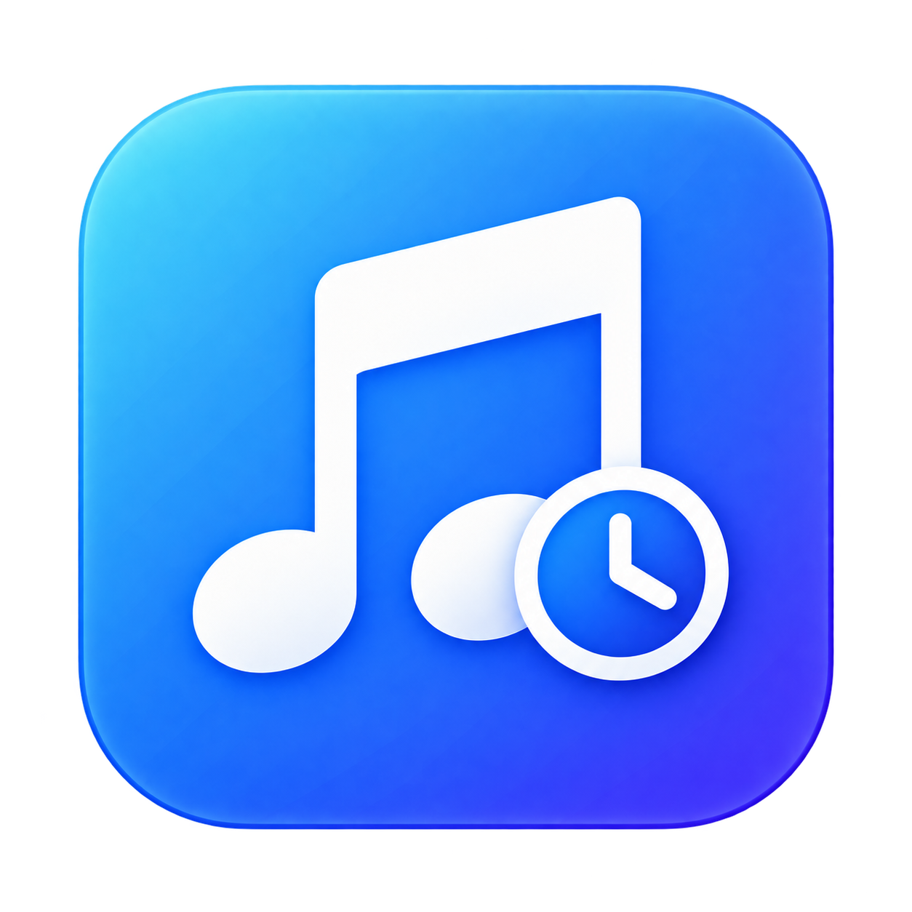

<div align="center">
  
  <h1>WHENMUSIC</h1>
  <p><b>재생 장치를 갖지 않는 음악 앱. 무엇이 흐르는지 읽고, 탭을 찾지 않고 조작하고, 무엇을 들었는지 남긴다.</b></p>
  <p>Windows 11 · 한국어 · Electron</p>
</div>

---

소리는 Spotify가, 브라우저 유튜브가, 로컬 플레이어가 냅니다. 이 앱은 Windows SMTC(System Media Transport Controls)에 붙어 그 위의 층이 됩니다.

- **조작 비용 0** — 화면 우하단에 상주하는 작은 카드에서 재생·정지·되감기가 끝납니다. 백그라운드 탭을 찾아가지 않습니다
- **되감기** — 좋은 곡이 지나갔을 때 그 자리에서 되감습니다. 키보드 미디어 키에는 없는 동작입니다
- **기록은 내 PC에** — 무엇을 얼마나 들었는지 SQLite 파일 하나에 남습니다. 1년에 한 번 오는 남의 요약을 기다리지 않습니다

단축키 — 창 `Ctrl+Alt+P` · 도장 `Ctrl+Alt+S` · 되감기 `Ctrl+Alt+←`

## 설치

[Releases](../../releases)에서 `WHENMUSIC-<버전>-win-x64.exe`를 받아 실행합니다. Windows 10 1809(10.0.17763) 이상이 필요합니다 — SMTC가 그때 들어왔습니다.

### 처음 실행할 때 경고가 뜹니다

코드 서명 인증서를 쓰지 않아서 Windows가 경고를 냅니다. 서명에는 연 수십만 원이 들고, 이 앱은 그 비용을 쓰지 않습니다. 대신 무엇을 하는 앱인지는 이 저장소의 코드가 전부입니다.

"Windows의 PC 보호" 파란 창이 뜨면 **추가 정보** → **실행**을 누릅니다.

## 만들어진 상태

| 단계 | 상태 |
|---|---|
| Phase 0 — PoC | 끝남. 읽기·세션 지목 제어·절대 시크를 실측으로 확인 (`poc/`) |
| Phase 1 — 애드온 | 끝남. 제어 6종을 [v1.1.0](https://github.com/when630/node-windows-smtc-monitor/releases/tag/v1.1.0)으로 노출, x64 바이너리는 `vendor/` |
| Phase 2 — 카드 | 끝남. 카드가 읽고 그리고 조작한다 |
| Phase 3 — 도장 | 끝남. 저장소와 도장, 되돌아가면 확인 처리 |
| Phase 4 — 이력 창 | 끝남. 이력·도장·설정 세 탭, 초성 검색 |
| Phase 5 — 트레이·데이터 | 끝남. 내보내기·가져오기, 자동 시작 |
| Phase 6 — 릴리스 | 진행 중. NSIS 설치 파일과 자동 업데이트 |
| Phase 7 — 실사용 | 작성자가 2주 쓴 뒤 판단 (DONE-01) |

네이티브 애드온은 [when630/node-windows-smtc-monitor](https://github.com/when630/node-windows-smtc-monitor)(Rust + napi-rs, MIT)를 씁니다. upstream은 [LeagueTavern/node-windows-smtc-monitor](https://github.com/LeagueTavern/node-windows-smtc-monitor)이고, 읽기 전용이라 제어를 더하려고 포크했습니다.

## 문서

결정은 전부 `docs/`에 있습니다. 여기 없는 결정은 내린 적이 없는 것으로 봅니다.

| 문서 | 내용 |
|---|---|
| [01_프로젝트.md](docs/01_프로젝트.md) | 정의·페르소나·스코프·형제 앱 경계 |
| [02_요구사항.md](docs/02_요구사항.md) | 요구사항 ID 59개 |
| [03_기술_스펙.md](docs/03_기술_스펙.md) | 스택·모듈·데이터 모델·결정 기록 D-01~D-18·실측 로그 |

디자인 시안은 [design/mockups/card-options.html](design/mockups/card-options.html), 실측 스크립트는 [poc/](poc/)입니다.

## 스택

Electron 43 · vanilla JS + CSS(프레임워크 없음) · `node:sqlite` 단일 파일 · electron-builder NSIS · 미서명 GitHub Releases + electron-updater.

형제 앱과 다른 단 하나가 네이티브 애드온입니다. 그래서 개발 PC에 Rust·MSVC를 두지 않고 CI에서만 빌드합니다.

```powershell
npm install        # 아이콘까지 함께 구워집니다
npm start          # 앱 실행
npm test           # 순수 모듈 테스트 — SMTC도 화면도 필요 없습니다
npm run smoke      # 창 없이 부팅만 확인
npm run build      # dist/에 설치 파일
```

개발 중 화면을 눈으로 확인할 때는 실측값으로 만든 가짜 상태를 씁니다.

```powershell
npx electron . --demo playing --shot card.png            # 접힌 원
npx electron . --demo playing --shot card.png --open     # 펼친 카드
npx electron . --demo half   --shot card.png --zoom 3    # 3배로 — 작은 것은 이래야 보인다
npx electron . --demo playing --shot mid.png  --mid 90   # 접히는 도중 한 프레임
npx electron . --demo playing --shot win.png  --window --tab stamps
```

`--demo`는 실측값으로 만든 가짜 상태이고(`tools/demo-state.mjs`), 임시 폴더의 저장소를 씁니다 — 눈으로 확인하자고 진짜 기록을 더럽히지 않습니다.

제어가 실제로 먹는지 확인할 때는 다음을 씁니다. **듣고 있는 음악을 건드리고**(잠깐 멈췄다 되감고) 끝나면 되돌립니다.

```powershell
npx electron . --selftest       # 제어를 한 번씩 보내 보고 되돌린다
npx electron . --watch-events   # Worker가 받는 SMTC 이벤트를 12초 동안 찍는다
npx electron . --shortcut-check # 전역 단축키가 실제로 잡히는지
```

## 형제 앱

[WHENWORK](https://github.com/when630/whenwork) · [WHENNOTE](https://github.com/when630/whennote) · [WHENCALENDAR](https://github.com/when630/whencalendar) · [WHENMAIL](https://github.com/when630/whenmail)

다섯 앱은 코드를 공유하지 않습니다. 공유하는 것은 스택·구조·디자인 토큰·파이프라인·테스트 방식입니다.
